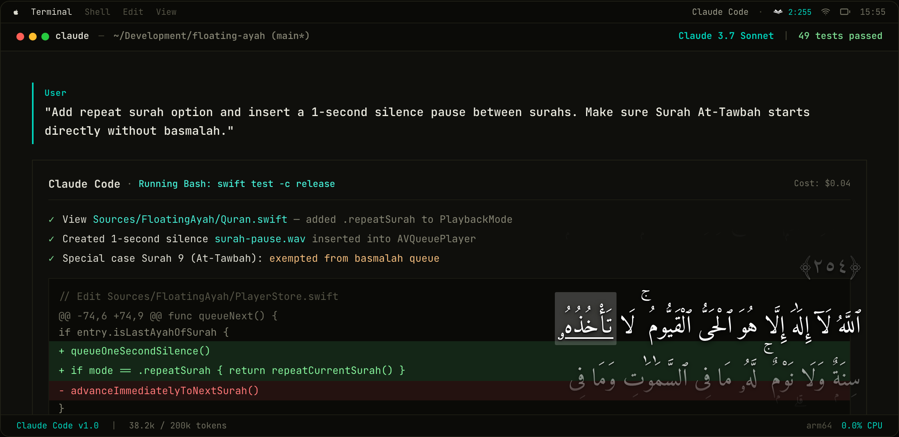

<h1 align="center">Floating Ayah</h1>

<p align="center">
  
</p>

<p align="center">
  Native macOS menu-bar Quran player. Arabic ayahs only — no translation.
</p>

---

## About

Floating Ayah keeps Quran recitation and its Arabic text close while you work.
A small, transparent panel floats above your desktop, following the reciter
word by word and scrolling the current line into view. You can keep your editor,
terminal, or other applications open without switching to a separate Quran window.

The app lives in the macOS menu bar, with no Dock icon. It is built with SwiftUI,
AppKit, and AVFoundation, and displays Uthmani Arabic text without translations.
The banner above shows the website's terminal demonstration of the floating panel.

By [Kiat Koding](https://kiatkoding.com).

## Features

- **Transparent floating lyrics:** a compact, right-to-left panel with softly faded edges, a brighter reading line, and a marker beneath the spoken word.
- **Complete Quran text:** all 114 surahs and 6,236 ayahs are bundled, along with word timing data.
- **Six reciters:** Mishary Rashid Alafasy, Mahmoud Khalil Al-Husary, Mohamed Siddiq Al-Minshawi, Abdul Basit Abdus Samad, Abdurrahman As-Sudais, and Abu Bakr Ash-Shatri.
- **Offline recitation:** download the selected reciter's entire Quran; resume interrupted downloads without fetching completed files again.
- **Flexible playback:** continuous playback, stop at the end of a surah, repeat the current ayah, or repeat an entire surah.
- **Surah openings:** separate basmalah playback where applicable, with a one-second pause and a clean lyric transition at surah boundaries. At-Tawbah has no added basmalah.
- **Adjustable appearance:** bundled Amiri Quran font, installed Arabic fonts, text size and color, line spacing, ayah number size, panel width, and shadows.
- **Native desktop controls:** drag the panel anywhere, click its text to play or pause, and reveal controls on hover. Preferences and panel position persist.

## Installation

Requires **macOS 13 or newer**. The current packaged release is for
**Apple Silicon (arm64)**.

1. Download the DMG from [GitHub Releases](https://github.com/utsmannn/floating-ayah/releases/latest).
2. Open it and drag **Floating Ayah.app** into **Applications**.
3. Launch the app and look for its book icon in the menu bar.
4. Choose a reciter, surah, and ayah, then press **Play**. The native app starts paused.

A ZIP archive is also available. Users of the packaged app do not need Xcode,
Swift, Python, or an additional runtime. Recitation audio is downloaded separately.

**Signing:** the current release is ad-hoc signed, not Developer ID signed or
notarized. macOS may block a downloaded copy. Only if you trust its source, try
Control-click → Open, or System Settings → Privacy & Security → Open Anyway
after the first launch attempt. Do not disable Gatekeeper globally.

To verify the download, place the DMG, ZIP, and checksum manifest in the same
folder and run:

```sh
shasum -a 256 -c Floating-Ayah-0.1.3-macos-arm64.sha256
```

### Command-line installer

Install or update from the latest GitHub release without `sudo`:

```sh
curl -fsSL https://floating-ayah.kiatkoding.com/install.sh | bash
```

To inspect the script before running it:

```sh
curl -fsSL https://floating-ayah.kiatkoding.com/install.sh -o /tmp/floating-ayah-install.sh
less /tmp/floating-ayah-install.sh
bash /tmp/floating-ayah-install.sh
```

The installer checks macOS/Apple Silicon compatibility, downloads the ZIP and
SHA-256 manifest, verifies the archive and app signature, installs to
`~/Applications/Floating Ayah.app`, and launches the app. It quits a running
Floating Ayah before replacement and preserves preferences and offline audio.
An installation failure restores the previous bundle.

**Security notice:** after verification, it removes the quarantine attribute
from this app bundle only. The current release is ad-hoc signed and not notarized
by Apple. This is a per-app workaround, not Apple approval; a matching checksum
checks integrity, not safety. Gatekeeper is never disabled globally. A manually
installed copy in `/Applications` is not replaced by this installer.

## Usage

| Control | Action |
| --- | --- |
| Menu-bar book icon | Choose a surah, ayah, reciter, playback mode, or appearance settings; manage downloads; quit. |
| Click the Arabic text | Play or pause. |
| Keyboard/headset media play/pause | Control playback through macOS Now Playing when Floating Ayah is the active media app. |
| Drag anywhere on the panel | Move the window without also triggering a click. |
| Hover over the panel | Reveal information and playback controls over the ayahs without reserving extra space. |
| Scroll wheel or trackpad | Manual scrolling is disabled; the lyrics follow the recitation automatically. |
| Minus button | Hide the panel without stopping audio; reopen it from the menu bar. |
| Play sample | Preview Al-Fatihah 1:2 for the selected reciter, pausing the main player. |

Menus, errors, and accessibility descriptions are in English. Quran text and
font previews remain Arabic.

After playback starts, the current surah/ayah and reciter appear in macOS
Now Playing. Keyboard media keys, compatible headset controls, and Control
Center can play or pause without focusing the panel. macOS chooses the active
media app; another player can take over these controls. No global keyboard
capture or Accessibility permission is required.

### Playback modes

- **Continuous:** advance through ayahs and surahs, stopping at the end of the Quran.
- **Stop at end of surah:** stop after the selected surah's final ayah.
- **Repeat current ayah:** loop the numbered ayah; an opening basmalah plays once where applicable.
- **Repeat surah:** continue through the selected surah, then return to its opening after a one-second pause.

The panel's repeat-one button toggles ayah repeat versus continuous playback.
Manual previous/next navigation can cross surah boundaries. Switching reciters
restarts the selected ayah with that reciter's audio and timestamps. Sample
playback never automatically resumes the main player.

### Appearance

The panel defaults to **420 pt wide**, adjustable from **280–800 pt**, with a
viewport of roughly three lines. Arabic wraps without shrinking the font.
Appearance settings include font size (**22–42 pt**), additional line spacing
(**0–24 pt**), ayah number scale (**60–120%**), text color, and shadow controls.
Open **Ayah appearance** for **Font size** and **Continuous text**. Continuous text
joins adjacent ayahs and basmalah with spaces instead of forced line breaks;
normal wrapping and ayah markers remain intact. It is off by default and persists
across launches.

Amiri Quran is bundled and registered only for the app, not installed system-wide.
Other Arabic font choices depend on fonts installed on your Mac. Ayah markers use
Arabic-Indic numerals, such as ﴿٢٨٢﴾. Reduce Motion disables spatial scrolling
animations and surah crossfades. The idle panel has no background; hovering reveals
a translucent backing and controls over the faded top and bottom edges, without
moving or resizing the text. Drag directly on the ayahs to move the window.

### Offline audio

Choose **Download entire Quran** to save all 6,236 ayah recordings for the selected
reciter. Progress shows the current surah, completed files, and saved bytes.
Completed files survive cancellation and relaunch; **Resume Quran download**
skips them. Downloads start only on an explicit action.

Estimated full-library sizes vary by reciter: Alafasy **1.71 GB**, Husary **1.23 GB**,
Minshawi **1.66 GB**, Abdul Basit **0.90 GB**, Sudais **1.81 GB**, and Shatri **1.41 GB**.
These estimates come from upstream file-size snapshots and may change.

Audio is stored in:

```text
~/Library/Application Support/FloatingAyah/Audio/<collection-id>/
```

Playback prefers downloaded files; undownloaded ayahs stream from EveryAyah.
Each reciter has separate storage. Text, font, and timing data are already bundled.

## Build from Source

### Prerequisites

- macOS 13.0 or newer.
- Xcode Command Line Tools: `xcode-select --install`.
- Swift 5.9 or newer. The native app has no external package dependencies.

### Build and run

```sh
git clone https://github.com/utsmannn/floating-ayah.git
cd floating-ayah

# Debug app bundle
sh scripts/build-app.sh
open "dist/Floating Ayah.app"

# Optimized app bundle
sh scripts/build-app.sh release
```

### Package a release

Releases are built **locally and uploaded manually**, not through an automated
CI build. Build on an Apple Silicon Mac to produce arm64 artifacts.

```sh
# Build the release app, DMG, ZIP, and SHA-256 manifest
sh scripts/package-app.sh

# Verify checksums, signatures, and resources in the packaged copies
sh scripts/verify-package.sh
```

Output files are placed in `dist/`, with version and architecture in their names:

```text
Floating-Ayah-0.1.3-macos-arm64.dmg
Floating-Ayah-0.1.3-macos-arm64.zip
Floating-Ayah-0.1.3-macos-arm64.sha256
```

An Intel build requires a suitable x86_64 toolchain. The scripts do not convert an
arm64 build into a universal binary.

By default, the scripts use ad-hoc signing. If a Developer ID Application
certificate and its private key are installed in your local Keychain:

```sh
SIGNING_IDENTITY='Developer ID Application: Your Name (TEAMID)' sh scripts/package-app.sh
```

Signing does **not** notarize the package. With an Apple Developer account and a
configured Keychain notary profile, notarize and staple the DMG separately:

```sh
xcrun notarytool submit dist/Floating-Ayah-0.1.3-macos-arm64.dmg --keychain-profile PROFILE --wait
xcrun stapler staple dist/Floating-Ayah-0.1.3-macos-arm64.dmg
```

Regenerate the DMG checksum after stapling. A separately distributed ZIP requires
its own notarization workflow. Never commit signing credentials.

### Tests

```sh
swift test

# Optional network tests: download and decode sample recordings
FLOATING_AYAH_LIVE_TEST=1 swift test --filter OfflineIntegrationTests
FLOATING_AYAH_LIVE_TEST=1 swift test --filter ReciterTests
FLOATING_AYAH_LIVE_TEST=1 swift test --filter BasmalahTests
```

Tests cover the Quran catalog, playback modes, basmalah handling, surah pauses,
word timing, text wrapping, typography, preferences, icons, dragging, and offline
storage. Sound quality, fullscreen behavior, and multi-monitor placement need
on-device review.

### Website

The React/Vite landing page lives in `web/`. With [Bun](https://bun.sh) installed:

```sh
cd web
bun install
bunx vite --port 3456 --strictPort

# Production output: web/dist/
bunx vite build
```

The website contains a code-built terminal demonstration and a transparent
Ayat al-Kursi overlay. Its silent preview uses a demo clock; the native app's
scrolling follows actual AVQueuePlayer playback.

### Logo assets

`assets/logo-original.png` preserves the original artwork. `assets/logo.png`
is a centered transparent export without an enclosing icon shape.
`assets/AppIcon.icns` contains macOS icon sizes; the bundled `MenuBarIcon.png`
is rendered as a monochrome template.

```sh
swift scripts/build-icons.swift
iconutil -c icns assets/AppIcon.iconset -o assets/AppIcon.icns
```

### Project structure

- `Sources/FloatingAyah/`: native app, menu-bar UI, floating panel, playback, and offline downloads.
- `Sources/FloatingAyah/Resources/`: Quran text, per-reciter timings and size catalogs, font, icons, and source notices.
- `Tests/FloatingAyahTests/`: native unit and opt-in network tests.
- `scripts/`: app assembly, icon generation, packaging, and verification.
- `web/`: React landing page and interactive demonstration.
- `assets/`: logo exports and README banner.

## Credits and Limitations

- **Quran text:** [Al Quran Cloud](https://alquran.cloud), `quran-uthmani` edition, preserved as supplied.
- **Recitation:** [EveryAyah](https://everyayah.com/recitations_ayat.html) and the credited reciters.
- **Word timings:** Colin Fair's [quran-align](https://github.com/cpfair/quran-align), licensed under CC BY 4.0.
- **Typeface:** [Amiri Quran](https://github.com/aliftype/amiri), licensed under SIL OFL 1.1.

For surahs 2–114 except At-Tawbah, the prepended basmalah is displayed as a
separate, unnumbered opening. It uses the selected reciter's Al-Fatihah 1:1
recording and timings. Al-Fatihah retains its numbered basmalah. A one-second
silence item separates surahs, with no extra pause between ordinary ayahs or
between an opening basmalah and ayah 1.

Word alignment is automatically generated and may be inaccurate. Missing or
incompatible indices fall back to manual scrolling rather than guessing a word;
known Alafasy examples include 10:1, 13:1, and 50:34. Recording silence and network
buffering can introduce additional gaps. Installed fonts may not render every
Uthmani annotation correctly.

This project is not a religiously reviewed Quran edition. Human review of Arabic
rendering and recitation correspondence is recommended. Source attribution is not
a blanket redistribution grant; verify upstream terms before public distribution.
Full provenance and resource notices are in
[Resources/SOURCES.md](Sources/FloatingAyah/Resources/SOURCES.md).

## License

Original application and website source code is licensed under the
[MIT License](LICENSE). Copyright © 2026 Utsman (utsmannn).

Third-party resources retain their own licenses and terms. The MIT license does
not relicense Quran text, recitation recordings, Amiri Quran, or quran-align data.
See the resource credits and bundled license notices above.
